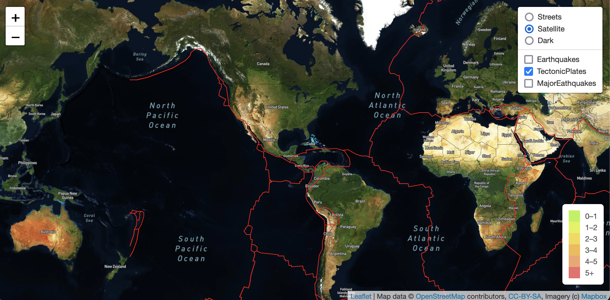
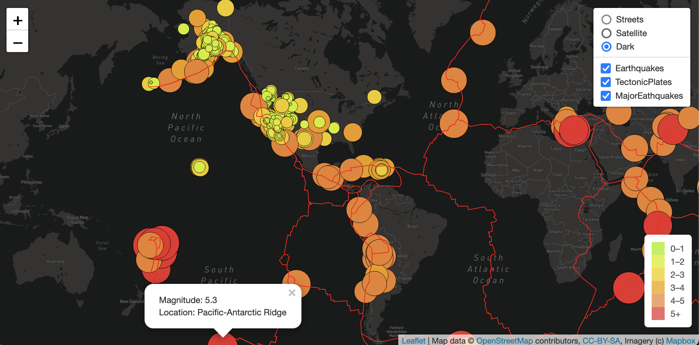

# Mapping Earthquakes

## Project Overview
A map is a symbolic depiction emphasizing relationships between elements of some space, such as objects, regions, or themes. Maps allow us to explore, understand, and make decisions about our world. 

In this repository we demonstrate the relationship between our worls and various data related to Earth Quakes. The project utilizes javascript (GeoJSON) to create interactive maps to visualize earthquake data. GeoJSON data can be found in many apps that have a map feature such as ride-sharing, navigation, and food and package delivery services. Even location services on smart phones use GeoSJON format.

## Purpose
- The purpose of this project is to visually show the differences between the magnitudes of earthquakes all over the world for the last seven days. 
- Show tectonic plates that run across our world. 
- Show the major Earth quakes the have occured. 

An interesting face is highlightedfrom the data, when we plot the major earth quakes along with tectonic plates we see all major Eartquakes aling with the tectonic plates. 

## Resources
### Software
- [MapBox](https://www.mapbox.com/) : Mapbox provides custom maps for websites and applications
- [Leaflet](https://leafletjs.com/) is a open-source JavaScript library for mobile-friendly interactive maps. Weighing just about 39 KB of JS, it has all the mapping features most developers ever need.
- Javascript:  We use java script to fetch data and process geoJSON data. 
- Tools: Visual studio code (recommended)

### Data Sources
- [majorAirports.json](majorAirports.json)
- [torontoNeighborhoods.json](torontoNeighborhoods.json)
- [torontoRoutes.json](torontoRoutes.json)
- https://earthquake.usgs.gov/data/data.php#eq
- https://github.com/fraxen/tectonicplates

# Results

The project has 3 map types 
- Street
- Satelite 
- Dark theme map

There are 3 overlaps we added which add data to the underlying maps. 
- Eathquakes - Gives info about all the Earthquakes in the last 7 days the circles diameters are allocated by magnitude of the eathquake. 

## Tectonic plates
We map all tectonic plate info of our world on the map. 

## Major Earthquake data
This layer shows all the major earthquakes, aligned by 3 categories. Earthquakes greaterthan 6 magnitude, Earthquakes greaterthan 5 and lessthan 6, less than 5.

## Dark Map
This is a dark map which can show any of the layer data. 
